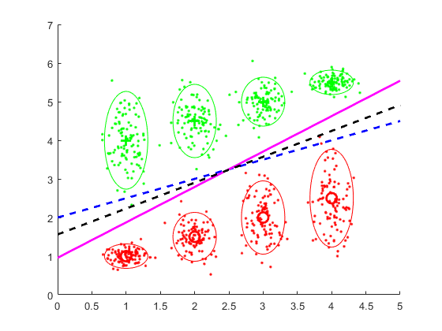
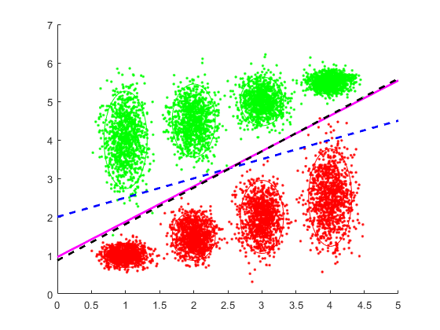

# Final Project for the Course COTA: a toy example of SVM-GSU
#### A toy example of SVM-GSU, which is described in *Linear Maximum Margin Classifierfor Learning from Uncertain Data*, TPAMI 2018. 

Requirement: Matlab + CVX

Usage: run main.m in Matlab console. 

## Illustration

 
 

Illustration on 2D data. 

* Red/green points: two classes of data points. 
* 1st image: comparison of SVM-GSU (pink solid line) with standard SVM (blue dash line). 
* 2nd/3rd image: comparison of SVM-GSU with standard SVM (black dash line) that learns by sampling 100/1000 points from the input Gaussian. 

## Related Link
* The paper of SVM-GSU: [link](https://www.researchgate.net/publication/275054882_Linear_Maximum_Margin_Classifier_for_Learning_from_Uncertain_Data)
* A full C++ implementation of SVM-GSU provided by the authors: [link](https://github.com/chi0tzp/svm-gsu)
